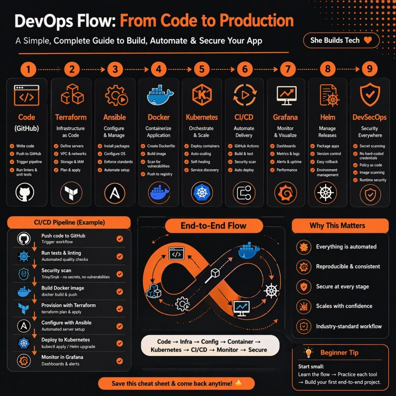

# DevOps Flow: Code to Production

Trying to understand how DevOps works from end to end?

Here’s a simple roadmap showing how applications move from **code → production** using real DevOps tools.

---

## DevOps Workflow

### 🔸 GitHub → Store & Manage Code
Used for:
- version control
- collaboration
- code reviews
- source management

---

### 🔸 Terraform → Provision Infrastructure
Used to create:
- servers
- networking
- cloud resources
- infrastructure as code

---

### 🔸 Ansible → Configure Servers
Used to:
- install packages
- configure systems
- automate server setup
- maintain consistency

---

### 🔸 Docker → Containerize Applications
Used to:
- package applications
- bundle dependencies
- ensure consistency across environments

---

### 🔸 Kubernetes → Orchestrate Containers
Used to:
- deploy containers
- scale applications
- handle failures automatically
- manage workloads

---

### 🔸 CI/CD → Automate Deployment
Used to:
- run automated tests
- build applications
- deploy updates automatically
- streamline delivery pipelines

---

### 🔸 Grafana → Monitor Systems
Used for:
- monitoring
- dashboards
- alerts
- performance visibility

---

### 🔸 DevSecOps → Secure the Pipeline
Security integrated into every stage:
- code scanning
- vulnerability checks
- secrets management
- runtime security

---

# Why This Flow Matters

A lot of beginners try learning DevOps tools randomly.

But understanding the **FLOW** changes everything.

Instead of memorizing tools…

You start understanding:
- how systems connect
- how deployments work
- how modern production environments operate

---

## Full Flow Overview

```text
Code → GitHub
Infrastructure → Terraform
Configuration → Ansible
Containers → Docker
Orchestration → Kubernetes
Automation → CI/CD
Monitoring → Grafana
Security → DevSecOps
```

---

Save this roadmap for your DevOps journey 



## A timeline is a way of showing events in the order they happened over time.

It helps people understand:

- when something happened
- what happened first
- what happened next
- Simple Example
```text
2019 → Started school
2021 → Learned programming
2023 → Got first job
2025 → Became DevOps engineer
```
### That sequence is called a timeline.

In simple words:

## A timeline is a visual or written order of events arranged by time.

### Where timelines are used:
- History
- Project planning
- Roadmaps
- Software development
- Personal life events
- Videos & storytelling

For example, in DevOps:
```text
Code → Build → Test → Deploy → Monitor
```
That can also be called a workflow timeline.

