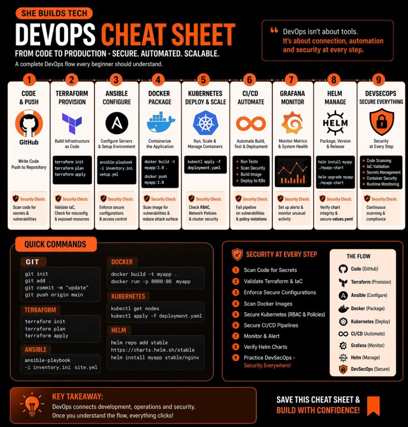

# DevOps Cheat Sheet

As I go deeper into DevOps, here is a quick summary of how DevOps works.

---




Most people learn DevOps like this:

- Docker today
- Kubernetes tomorrow
- Terraform next week

But no one really shows how everything connects inside a real company.

So let’s make it make sense.

---

# Meet Alex

She just built an application.

It works perfectly on her laptop.

But now her company says:

> “We need this running in production — secure, scalable, and reliable.”

Now the real journey begins.

---

## Step 1: Code (GitHub)

Alex pushes her code to GitHub.

But code alone is not enough.

Because the moment it leaves her laptop…

- 👉 environments change
- 👉 things break
- 👉 bugs appear

---

## Step 2: Terraform (Building Infrastructure)

Instead of clicking around manually…

Alex writes:
- servers
- networking
- load balancers

as code.

With one command:

Infrastructure is created.

But here’s the twist:

She also runs security checks:
- No exposed credentials
- No open ports
- Proper configurations

---

## Step 3: Ansible (Configuring Everything)

Now she has empty servers.

She uses Ansible to:
- install packages
- configure environments
- set up security rules

Everything is automated.

Everything is consistent.

---

## Step 4: Docker (Packaging the App)

Her app worked on her machine…

But production is different.

So she packages everything into a container.

- 👉 Same app
- 👉 Same dependencies
- 👉 Same behavior everywhere

---

## Step 5: Kubernetes (Running at Scale)

Traffic comes in.

Users increase.

Things fail.

Kubernetes steps in:
- runs containers
- scales automatically
- restarts failures
- keeps everything healthy

---

## Step 6: CI/CD Pipeline (Automation)

Every time Alex pushes code:

- 👉 tests run
- 👉 security scans check for vulnerabilities
- 👉 Docker images build
- 👉 deployment happens automatically

No manual stress.

---

## Step 7: Monitoring (Grafana)

Now everything is live.

But Alex needs visibility.

She monitors:
- performance metrics
- system health
- alerts

Grafana helps her monitor everything in real time.

---

## Step 8: Helm (Managing Deployments)

Instead of messy configurations…

Helm helps her:
- manage Kubernetes apps
- version deployments
- roll back if something breaks

---

## Step 9: DevSecOps (Security at Every Step)

Here’s what most people miss:

Security is not a single step.

It’s everywhere.

- ✔️ Code scanning
- ✔️ Infrastructure validation
- ✔️ Secrets management
- ✔️ Container security
- ✔️ Runtime monitoring

---

# The Full Flow

```text
Code → GitHub
Terraform → Build infrastructure
Ansible → Configure servers
Docker → Package app
Kubernetes → Run & scale
CI/CD → Automate everything
Grafana → Monitor
Helm → Manage deployments
Security → Everywhere
```

---

If this helped you finally see the system instead of just individual tools…
