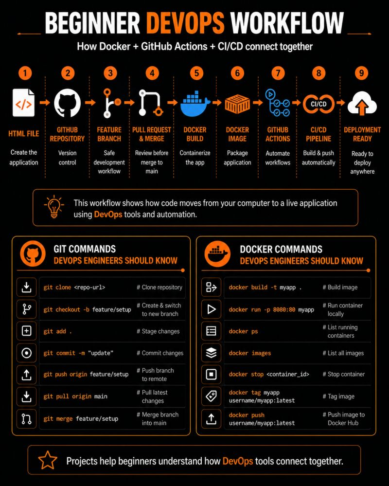

# Docker, GitHub Actions & CI/CD Pipelines

Most beginners learn Docker, GitHub Actions, and CI/CD pipelines separately…

But still don’t understand how everything connects in a real DevOps workflow.

So I decided to build something real.

---




## Here’s What I Built

A simple web application using:
- Docker
- GitHub Actions
- CI/CD Automation
- Docker Hub

And honestly…

This is a great beginner DevOps project for understanding how modern deployment workflows actually work.

---

## Here’s the Workflow I Followed

### 1️⃣ Started with Git & GitHub

First, I created a simple HTML status page and pushed it to GitHub.

Then, instead of making changes directly on the `main` branch…

I created a feature branch called:

```bash
feature/setup
```

From there:
- updated the HTML page
- tested changes safely
- pushed changes to the feature branch
- opened a Pull Request
- merged into `main`

This is how real DevOps teams collaborate without breaking production code.

---

### 2️⃣ Dockerized the Application

Next, I packaged the application using Docker.

I:
- ✅ wrote a Dockerfile
- ✅ used Nginx to serve the app
- ✅ built the image locally
- ✅ ran the container on localhost

This helps beginners understand:
- Docker images
- containers
- port mapping
- containerized deployments

---

### 3️⃣ Built a CI/CD Pipeline with GitHub Actions

This part was my favorite.

I created a GitHub Actions workflow that:

- ✅ automatically builds the Docker image
- ✅ pushes it to Docker Hub
- ✅ runs every time code is pushed to `main`

And this is where you begin to understand what CI/CD actually looks like in real DevOps workflows.

```text
Code → Build → Push → Deploy
```

---

## Biggest Thing I Learned

If you’re a beginner in DevOps…

Projects like this help you understand how tools connect together in real environments instead of learning everything in isolation.

---

## I Also Created a Visual Cheat Sheet Showing

- ✅ the full workflow
- ✅ branching strategy
- ✅ Docker flow
- ✅ CI/CD process
- ✅ common Git & Docker commands

### Repository
https://lnkd.in/enm_YEEH

---

## And This Is Only Part 1

Next, I’ll show:
- how I deployed the app for free
- how I added monitoring & logging
- how uptime monitoring works in DevOps

---

**Comment “PART 2” if you want to see the deployment + monitoring side.**

Repost this — someone in your network might need it today.
