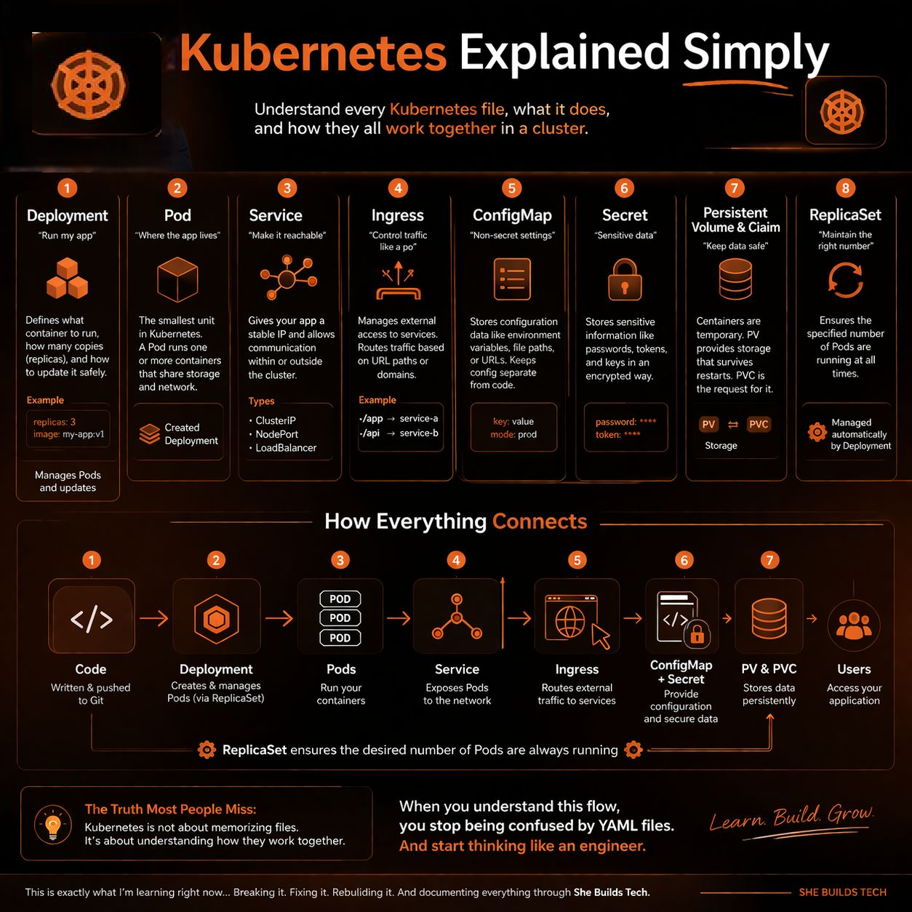

# Here’s a simple way I finally understood Kubernetes

Because let’s be honest:

Most people learn Kubernetes like this:

- Pod today
- Service tomorrow
- Deployment next week

And at the end?

Still confused.

Because no one explains how all the pieces connect.

Meet Alex again.

She already:

- ✔ Built her app
- ✔ Dockerized it
- ✔ Has it ready

Now her company says:

> “Deploy this on Kubernetes.”

And that’s where confusion usually starts.

## Kubernetes: Not just one thing, but a system

Think of Kubernetes like a city.

Each file you write is like a set of instructions telling the city what to do.

## 1. Deployment: “Run my app”

Alex starts here.

She writes a Deployment file.

This tells Kubernetes:

- What container to run: the Docker image
- How many copies to run: replicas
- How to update the app safely

Example:

> “I want 3 copies of my app always running.”

If one crashes, Kubernetes replaces it automatically.

## 2. Pod: “Where the app lives”

A Pod is the smallest unit in Kubernetes.

It’s where your container actually runs.

But here’s the catch:

> You don’t usually create Pods directly.

Deployment manages Pods for you.

## 3. Service: “Make it reachable”

Now Alex has her app running, but no one can access it.

That’s where a Service comes in.

It:

- Gives the app a stable IP
- Allows communication inside the cluster
- Can expose the app to users

Common Service types:

- ClusterIP: internal access
- NodePort: external access through a node
- LoadBalancer: public access

## 4. Ingress: “Control traffic like a pro”

Instead of exposing many services, Alex uses an Ingress.

It acts like a smart gate:

- If a user goes to `/login`, send them to this service
- If a user goes to `/api`, send them somewhere else

Clean URLs. Better control.

## 5. ConfigMap: “Non-secret settings”

Her app needs configs:

- Environment = production
- API URLs

Instead of hardcoding them, she uses a ConfigMap.

> Keeps config separate from code.

## 6. Secret: “Sensitive data”

Passwords. Tokens. Keys.

These go into Secrets.

> Secrets are not exposed like normal configs.

## 7. Persistent Volume: “Keep data safe”

Containers are temporary.

If they restart, data can disappear.

So Alex uses:

- Persistent Volume: PV
- Persistent Volume Claim: PVC

This keeps data safe even if containers die.

## 8. ReplicaSet: “Keep the right number running”

Behind every Deployment, there’s a ReplicaSet.

Its job:

> “Make sure exactly X Pods are running.”

## How everything connects

1. Deployment creates Pods.
2. ReplicaSet ensures the right number of Pods stays running.
3. Pods run your containers.
4. Service exposes Pods.
5. Ingress manages external access.
6. ConfigMap and Secret provide configuration.
7. PV and PVC store persistent data.

## The truth most people miss

Kubernetes is not about memorizing files.

It’s about understanding how they work together.

## Real takeaway

When you understand this flow, you stop being confused by YAML files.

And you start thinking like this:

> “How do I want my system to behave?”
