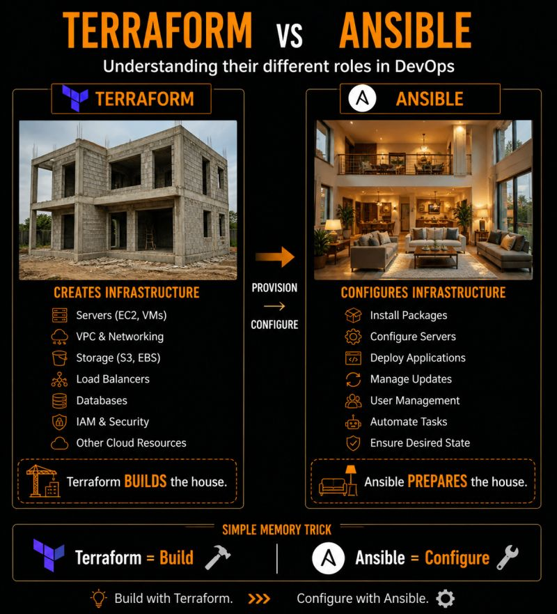

# Terraform vs Ansible

Beginners often confuse Terraform and Ansible.

Honestly…  
I used to mix them up too.

Until I stopped looking at them as “tools”  
and started looking at them as roles.

Here’s the simplest way I finally understood it:

Imagine you’re given a task to prepare a brand-new house 🏠

First…

You need:
- the land
- the walls
- the rooms
- electricity
- water
- the structure itself

That’s Terraform.

## Terraform BUILDS the house 🏗

It creates:
- servers
- networking
- load balancers
- cloud infrastructure
- databases

But the house is still empty.

Now someone needs to:
- install things
- arrange everything
- configure the rooms
- prepare the environment
- make the house usable

That’s Ansible.

## Ansible PREPARES the house

It handles:
- server configuration
- package installation
- deployments
- automation tasks
- updates and management

And that’s when everything finally clicked for me.

## The Core Difference

- **Terraform** = Provision Infrastructure
- **Ansible** = Configure Infrastructure

Both work together.  
Not against each other.

And once you understand their roles…

DevOps starts making much more sense.

---

**Which one confused you more when you started: Terraform or Ansible? 👀**
