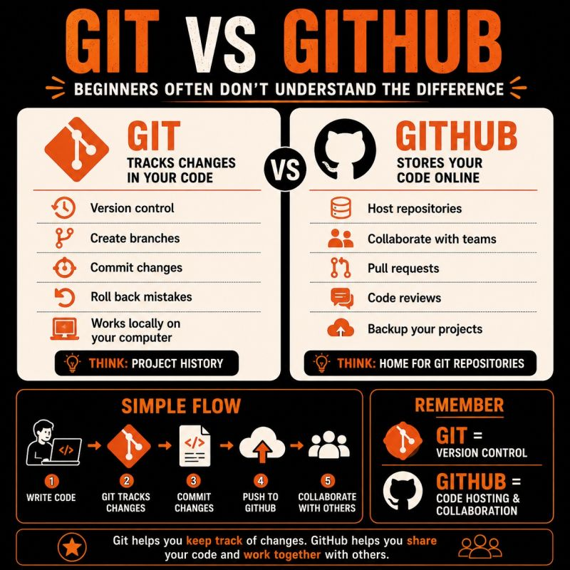

# Git vs GitHub: Simple Explanation for Beginners

Beginners often don’t understand the difference between **Git** and **GitHub**.

Honestly…

I used to think they were the same thing too.

Until I stopped looking at them as one tool.

And started looking at them as two different roles.




---

## The Simplest Way to Understand Git and GitHub

Imagine you’re writing a book.

Every day, you make changes.

Sometimes you make mistakes.

Sometimes you want to go back to an older version.

That’s **Git**.

---

## What Is Git?

**Git** tracks every change you make in your project.

It lets you:

- Save versions
- Create branches
- Experiment safely
- Go back when things break

Think of **Git** as your **version control system**.

---

## What Is GitHub?

Now…

What if you want to share that book with other people?

Or back it up online?

Or collaborate with a team?

That’s **GitHub**.

**GitHub** stores your Git repositories online.

It helps teams:

- Collaborate
- Review code
- Open pull requests
- Manage projects

Think of **GitHub** as a **code hosting and collaboration platform**.

---

## Simple Way to Remember

| Tool | Meaning |
|---|---|
| **Git** | Version Control |
| **GitHub** | Code Hosting & Collaboration |

---

## Basic Git and GitHub Flow

```text
Write Code
   ↓
Git tracks changes
   ↓
Commit your work
   ↓
Push to GitHub
   ↓
Collaborate with others
```

---

## Final Thought

One thing I’m realizing:

A lot of DevOps concepts become easier when you stop memorizing tools…

and start understanding the problem each tool solves.

**Git and GitHub are a perfect example.**

---

## Question

Which one confused you more when you started?

**Git or GitHub?**

---

# Basic Git Workflow Concepts

## Table of Contents

* [git status](#git-status)
* [git add](#git-add)
* [git commit](#git-commit)
* [git push](#git-push)
* [Git Workflow Summary](#git-workflow-summary)

---

# git status

## Purpose

Shows the current state of the working directory and staging area.

## What It Tells Us

* Modified files
* Staged files
* Untracked files
* Current branch information
* Whether the branch is ahead or behind the remote repository

## Example

```bash
git status
```

---

# git add

## Purpose

Stages a file for the next commit.

It tells Git:

> Include this file in the next commit.

## Example

Stage a single file:

```bash
git add README.md
```

Stage all files:

```bash
git add .
```

---

# git commit

## Purpose

Creates a snapshot of the staged changes and stores it in Git history.

A commit represents a saved point in the project's history.

## Example

```bash
git commit -m "Add Docker notes"
```

## Result

* Creates a new Git history entry
* Saves staged changes locally
* Prepares the changes to be pushed to a remote repository

---

# git push

## Purpose

Uploads local commits to a remote repository such as GitHub.

## Example

```bash
git push origin main
```

## Result

* Sends local commits to GitHub
* Makes changes available to other team members
* Stores commits safely on the remote repository

---

# Git Workflow Summary

```text
Working Directory
        │
        ▼
     git add
        │
        ▼
   Staging Area
        │
        ▼
 git commit -m
        │
        ▼
   Local Git History
        │
        ▼
     git push
        │
        ▼
 Remote Repository (GitHub)
```

---

# Quick Reference

| Command                   | Purpose                             |
| ------------------------- | ----------------------------------- |
| `git status`              | Show repository status              |
| `git add <file>`          | Stage a file for commit             |
| `git add .`               | Stage all changes                   |
| `git commit -m "message"` | Create a Git history snapshot       |
| `git push`                | Upload commits to remote repository |

---

# Key Takeaway

Git follows a simple workflow:

1. Modify files in the Working Directory
2. Stage changes using `git add`
3. Save changes to Git history using `git commit`
4. Upload commits to GitHub using `git push`

```
```

---

# Working Directory and Staging Area in Git

## Table of Contents

1. Introduction
2. What is the Working Directory?
3. What is the Staging Area?
4. What is a Commit?
5. How Git Tracks Changes
6. Real-Life Example
7. Step-by-Step Workflow
8. Visual Diagram
9. Common Git Commands
10. Working Directory vs Staging Area
11. Key Takeaways

---

# Introduction

Git uses three main areas to manage changes:

```text
Working Directory
       ↓
Staging Area
       ↓
Git Repository (Commit History)
```

Understanding these areas is essential for learning Git and GitHub.

---

# What is the Working Directory?

The Working Directory is the place where you create, edit, rename, and delete files.

Example:

```text
project/
├── README.md
├── notes.md
└── app.py
```

Any changes you make to files happen in the Working Directory first.

## Examples

Create a file:

```bash
touch notes.md
```

Edit a file:

```bash
vim notes.md
```

Check status:

```bash
git status
```

Output:

```text
Changes not staged for commit:
    modified: notes.md
```

This means the file exists only in the Working Directory and has not been staged yet.

---

# What is the Staging Area?

The Staging Area is a temporary holding area where you choose which changes should be included in the next commit.

Git calls this process "staging".

Stage a file:

```bash
git add notes.md
```

Check status:

```bash
git status
```

Output:

```text
Changes to be committed:
    modified: notes.md
```

Now Git knows that this file should be included in the next commit.

---

# What is a Commit?

A commit is a permanent snapshot of the staged changes.

Create a commit:

```bash
git commit -m "Add notes file"
```

The commit is stored in Git history and can be viewed later.

---

# How Git Tracks Changes

## Step 1: Modify File

```text
Working Directory
```

## Step 2: Stage File

```bash
git add filename
```

```text
Staging Area
```

## Step 3: Commit Changes

```bash
git commit -m "message"
```

```text
Git Repository
```

---

# Real-Life Example

Imagine writing a book.

## Working Directory

You are writing and editing pages.

```text
Draft on your desk
```

## Staging Area

You select pages that are ready.

```text
Pages placed in a submission folder
```

## Commit

You submit those pages permanently.

```text
Official version saved
```

---

# Step-by-Step Workflow

### Create a file

```bash
echo "Hello Git" > notes.md
```

### Check status

```bash
git status
```

Output:

```text
Untracked files:
    notes.md
```

### Stage file

```bash
git add notes.md
```

### Commit file

```bash
git commit -m "Add notes file"
```

---

# Visual Diagram

```text
┌─────────────────────┐
│  Working Directory  │
│                     │
│ Create Files        │
│ Edit Files          │
│ Delete Files        │
└──────────┬──────────┘
           │
           │ git add
           ▼
┌─────────────────────┐
│    Staging Area     │
│                     │
│ Ready to Commit     │
└──────────┬──────────┘
           │
           │ git commit
           ▼
┌─────────────────────┐
│   Git Repository    │
│                     │
│ Commit History      │
└─────────────────────┘
```

---

# Common Git Commands

| Command | Purpose |
|----------|----------|
| git status | Show repository status |
| git add file | Stage a specific file |
| git add . | Stage all changes |
| git restore --staged file | Remove file from staging area |
| git commit -m "message" | Create a commit |
| git log | View commit history |

---

# Working Directory vs Staging Area

| Working Directory | Staging Area |
|------------------|-------------|
| Where files are edited | Where files are prepared for commit |
| Changes are not yet selected | Changes are selected |
| Can contain many edits | Contains only chosen changes |
| First step in workflow | Second step in workflow |

---

# Key Takeaways

## Working Directory

The place where you create and modify files.

## Staging Area

A temporary area where you select changes for the next commit.

## Commit

A permanent snapshot stored in Git history.

## Git Workflow

```text
Working Directory
       ↓
git add
       ↓
Staging Area
       ↓
git commit
       ↓
Git Repository
```
